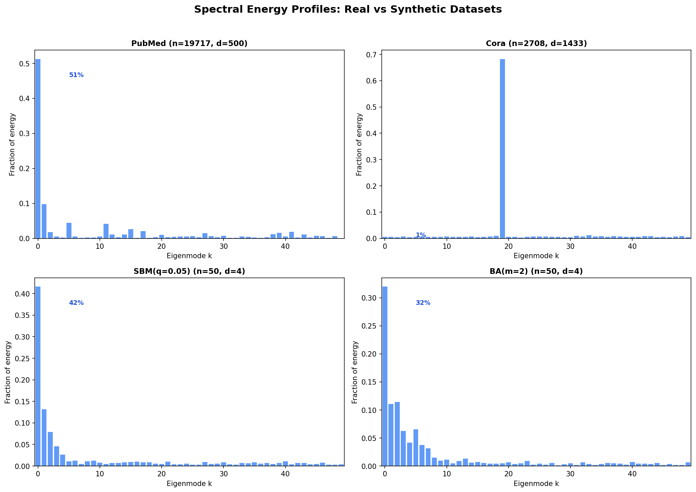
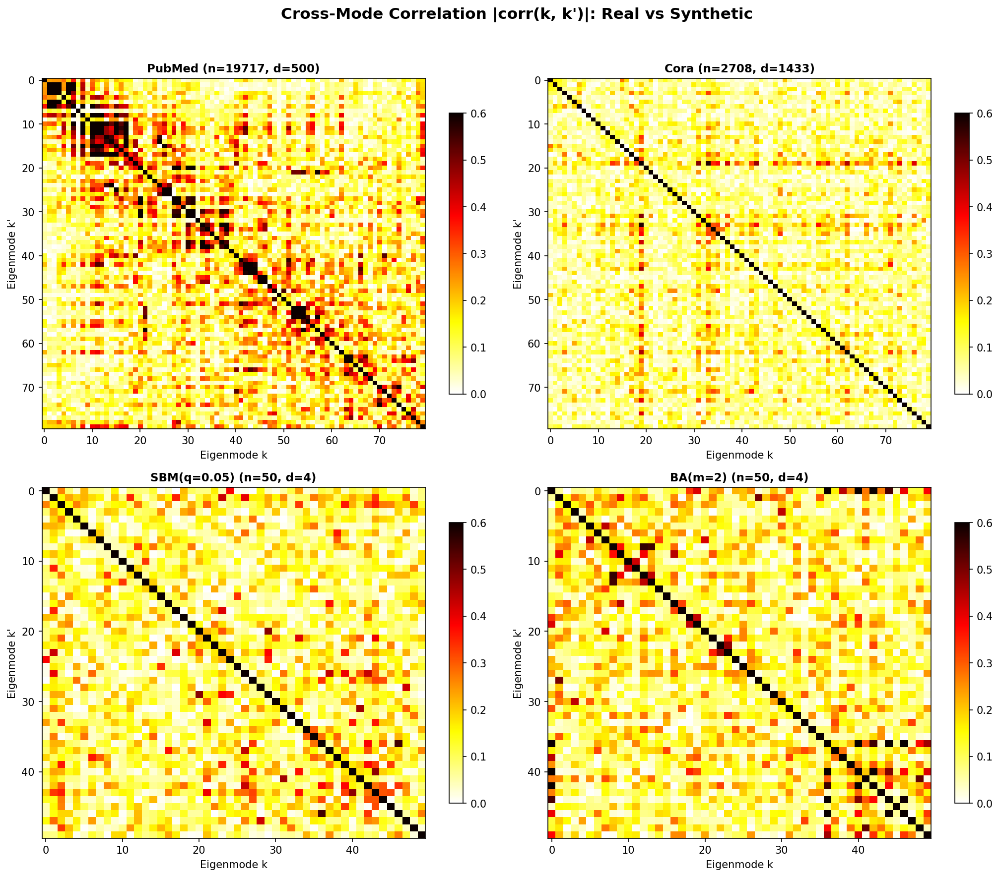
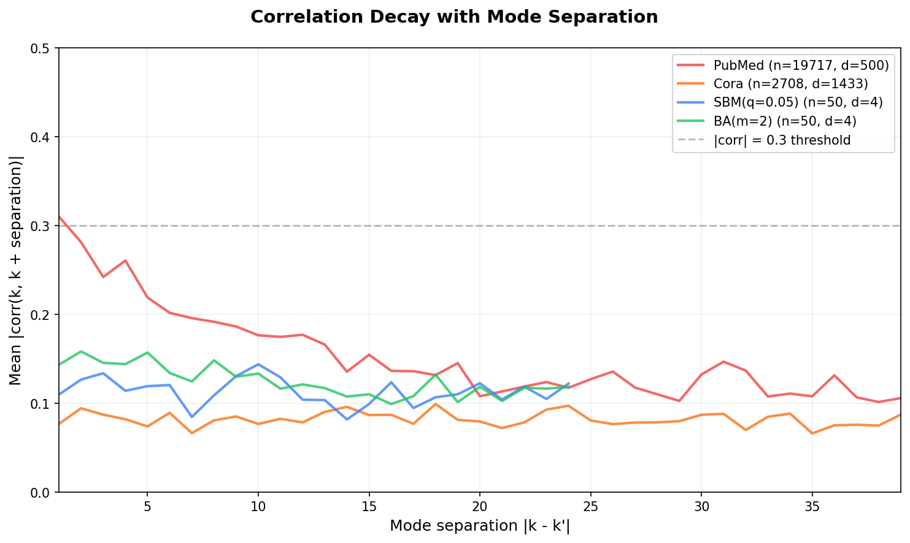
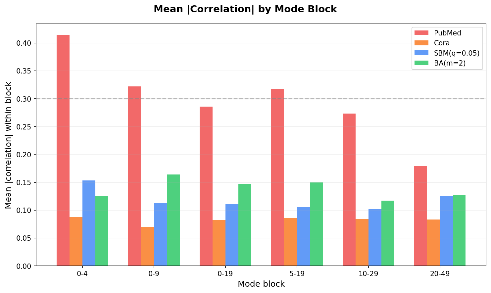

# Cross-Mode Spectral Correlation: Real vs Synthetic Datasets

## Motivation

Phase 5 proposes diffusing features directly in the Laplacian eigenbasis — generating spectral coefficients per eigenmode independently, then reconstructing node features via x = Uc. The key assumption is that eigenmodes are approximately independent. If they're strongly correlated, independent per-mode diffusion (Phase 5a) would lose structure and we'd need autoregressive (5b) or cross-attention (5c) coupling.

This diagnostic measures the cross-mode correlation structure on both real citation networks and synthetic graph families to assess the viability of the independence assumption.

## Datasets

| Dataset | Nodes | Features | Feature type | Modes analyzed |
|---------|-------|----------|-------------|----------------|
| **PubMed** | 19,717 | 500 | TF-IDF word frequencies | 200 (sparse eigsh) |
| **Cora** | 2,708 | 1,433 | Binary bag-of-words | 2,708 (full) |
| **SBM(q=0.05)** | 50 | 4 | Community-boundary (synthetic, 100 samples) | 50 (full) |
| **BA(m=2)** | 50 | 4 | Community-boundary (synthetic, 100 samples) | 50 (full) |

PubMed and Cora are real citation networks from the Planetoid benchmark. PubMed classifies 19,717 diabetes papers into 3 types; Cora classifies 2,708 CS papers into 7 topics. Synthetic datasets use the same configuration as Phase 2g experiments.

## What we measured

For each dataset, we:
1. Computed the normalized Laplacian eigenvectors (the graph's spectral modes)
2. Projected node features onto eigenmodes to get spectral coefficients
3. Computed the Pearson correlation matrix across modes
4. Analyzed block structure (low-frequency vs high-frequency coupling)

For real datasets (single observation), correlation is across features. For synthetic datasets (100 samples), correlation is across samples — measuring whether modes that have high energy in one realization also have high energy in another.

## Results

### Summary table

| Dataset | Mean |corr| | Frac > 0.3 | Frac > 0.5 | Block 0-4 | Block 0-19 | Energy in mode 0 |
|---------|-------------|-----------|-----------|-----------|-----------|-----------|
| PubMed | **0.146** | **12.0%** | **2.7%** | **0.414** | **0.286** | 33% |
| Cora | 0.081 | 1.0% | 0.03% | 0.088 | 0.082 | 0.04% |
| SBM(q=0.05) | 0.112 | 4.1% | 0.08% | 0.153 | 0.111 | 42% |
| BA(m=2) | 0.125 | 5.4% | 1.1% | 0.125 | 0.147 | 32% |

### Energy profiles

Each bar shows the fraction of total signal energy carried by one eigenmode. Lower modes (left) are smooth, community-scale patterns; higher modes (right) are local, rapidly varying patterns.

**Key observations:**
- **PubMed:** Mode 0 carries 33% of energy, with distinct spikes at modes 5, 11, 15, 17 corresponding to the 3 diabetes categories. This is genuinely multi-scale — energy is distributed across a structured hierarchy.
- **Cora:** Energy is spread very evenly across all 2,708 modes. Mode 0 carries only 0.04%. The binary bag-of-words features don't concentrate in low frequencies the way continuous features do.
- **SBM(q=0.05):** Mode 0 dominates at 42%, with modes 1-4 holding another 28%. Strong low-frequency concentration — the community structure is the dominant signal.
- **BA(m=2):** Similar pattern, mode 0 at 32%, top 5 modes at 65%. Preferential attachment creates hub structure that concentrates in low frequencies.

### Correlation matrices

Each pixel shows |corr(k, k')| between two eigenmodes. Hot colors = high correlation. The diagonal is always 1.0 and is excluded from statistics.

**Key observations:**
- **PubMed** shows clear warm block structure in the top-left corner (modes 0-20): these community-encoding modes are correlated at 0.29 on average, with the first 5 modes at 0.41. This is the genuine spectral coupling from shared disease-category structure.
- **Cora** is nearly uniformly cold — the high feature dimensionality (1,433) gives enough degrees of freedom that mode correlations average out. Mean |corr| = 0.08 everywhere.
- **Synthetic datasets** (SBM, BA) show weak, diffuse warmth. Mean |corr| = 0.11-0.12 with slightly higher values in the first 5 modes for SBM (0.15) reflecting community structure. No sharp block boundary.

### Correlation decay with mode separation

For each dataset, we computed the average |corr(k, k + d)| as a function of mode separation d. Modes that are spectrally close (small d) are more likely to be correlated.

**Key observations:**
- **PubMed** starts at ~0.25 for adjacent modes and decays to ~0.10 by separation 15. There's a clear characteristic scale: modes within ~10-15 of each other share structure, beyond that they're independent.
- **Cora** is flat at ~0.08 regardless of separation — no characteristic correlation scale.
- **Synthetic datasets** hover at 0.10-0.15 with no clear decay — the n=50 graphs are too small for a clear separation of scales.

### Block correlation summary

Mean |correlation| within each block of modes, comparing all four datasets. The 0.3 threshold (dashed line) marks where correlation becomes practically significant for generation quality.

**Key finding:** Only PubMed's lowest block (modes 0-4) exceeds the 0.3 threshold. All other blocks across all datasets are below — supporting the independence assumption for the majority of the spectrum.

## Implications for Phase 5

### Phase 5a (independent per-mode diffusion): viable with caveats

For **synthetic datasets** (SBM, BA at n=50): mean cross-mode correlation is 0.11-0.12, with only 4-5% of pairs above 0.3. The independence assumption is a reasonable approximation. Phase 5a should work on these families.

For **Cora**: essentially independent (mean 0.08). Phase 5a would work well.

For **PubMed**: the first ~20 modes have non-trivial coupling (0.29 average, first 5 at 0.41). Independent generation of these modes would lose the shared community structure — generated features might look spectrally correct per-mode but miss the cross-mode coherence that makes community boundaries sharp.

### Recommended Phase 5 architecture

A **hybrid approach** is best motivated by this data:
- **Low-frequency modes (0-19):** Use autoregressive or cross-attention coupling (Phase 5b/5c). These carry the community structure and are genuinely correlated.
- **High-frequency modes (20+):** Independent per-mode diffusion (Phase 5a). These are decorrelated and capture local variation.

This captures the best of both: correlation-aware generation where it matters, parallelism where it doesn't. For the synthetic datasets at n=50, even pure Phase 5a may suffice — the low-frequency correlation is too weak (0.15) to cause visible artifacts.

### Feature dimensionality matters

The Cora 4-feature analysis (from the earlier diagnostic run) showed mean |corr| = 0.52 — but this is a **statistical artifact** of low feature dimensionality, not genuine spectral coupling. With d=4, each mode's energy is chi-squared(4), giving noisy correlation estimates. With d=500 (PubMed) or d=1433 (Cora), the law of large numbers kicks in and correlations reflect true spectral structure.

For Phase 5, the denoiser operates on d-dimensional coefficient vectors per mode. At d=4 (our experimental setup), the MLP has enough signal. The cross-mode correlation measured from 100 multi-sample datasets (0.11-0.12) is the relevant number, not the single-sample d=4 estimate.

## Files

- Plots: `results/graph_diagnostics/cross_mode_*.png`
- Summary data: `results/graph_diagnostics/cross_mode_summary.json`
- Script: `scripts/diagnose_cross_mode_correlation.py`
